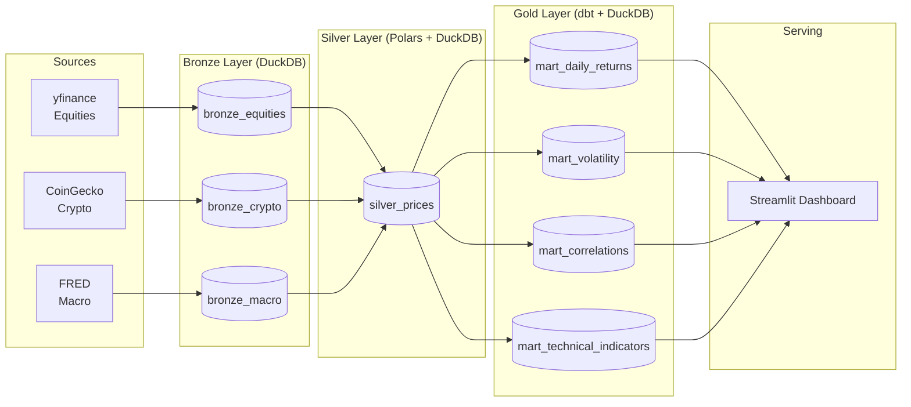

# MarketLens

> An end-to-end financial market data pipeline: **DuckDB + dbt + Polars + Prefect + Streamlit**.
> Medallion architecture (Bronze → Silver → Gold) with automated CI and Docker-based local deployment.

---

## Architecture



---

## Tech Stack

| Layer | Tool |
|---|---|
| Data processing | [Polars](https://pola.rs/) |
| Data warehouse | [DuckDB](https://duckdb.org/) |
| SQL transformations | [dbt-duckdb](https://github.com/duckdb/dbt-duckdb) |
| Orchestration | [Prefect](https://www.prefect.io/) |
| Dashboard | [Streamlit](https://streamlit.io/) + [Plotly](https://plotly.com/) |
| Config | [pydantic-settings](https://docs.pydantic.dev/latest/concepts/pydantic_settings/) |
| CI | GitHub Actions |
| Infra | Docker Compose |

---

## Quick Start

### Prerequisites

- Python 3.12+
- `pip` or [`uv`](https://github.com/astral-sh/uv)

### Local development

```bash
# 1. Clone and install
git clone https://github.com/your-username/marketlens.git
cd marketlens
make install

# 2. Copy env file
cp .env.example .env

# 3. Bootstrap the database schema
make bootstrap

# 4. Run the full pipeline (ingest → transform → dbt)
make pipeline

# 5. Launch the dashboard
make dashboard
# Open http://localhost:8501
```

### Docker

```bash
cp .env.example .env
docker compose up --build
# Dashboard available at http://localhost:8501
```

---

## Project Structure

```
marketlens/
├── marketlens/          # Core Python package
│   ├── config.py        # Typed settings via pydantic-settings
│   ├── db.py            # DuckDB connection factory + schema bootstrap
│   ├── ingestion/       # Bronze layer: yfinance, CoinGecko, FRED ingesters
│   ├── transforms/      # Silver layer: Polars-based cleaning and enrichment
│   └── flows/           # Prefect orchestration flows
├── dbt/                 # dbt project (Silver staging + Gold mart models)
├── dashboard/           # Streamlit multi-page app
├── tests/               # pytest test suite
└── scripts/             # CLI entry points
```

---

## Data

All data sources are **free and require no API keys**:

| Source | Data | Library |
|---|---|---|
| Yahoo Finance | Equity OHLCV (SPY, QQQ, GLD, TLT, IWM) | `yfinance` |
| CoinGecko | Crypto OHLC (BTC, ETH, SOL) | `requests` |
| FRED | Macro indicators (10Y yield, Fed Funds) | `pandas-datareader` |

---

## Analytics (Gold Layer)

Implemented entirely in SQL with DuckDB window functions:

- **Rolling volatility** — 30-day and 90-day annualized realized vol
- **Correlations** — 90-day rolling Pearson correlation matrix across all assets
- **Technical indicators** — RSI-14, MACD (12/26/9), Bollinger Bands (20-period)
- **Daily returns** — Normalized return table pivoted by symbol

---

## License

MIT
