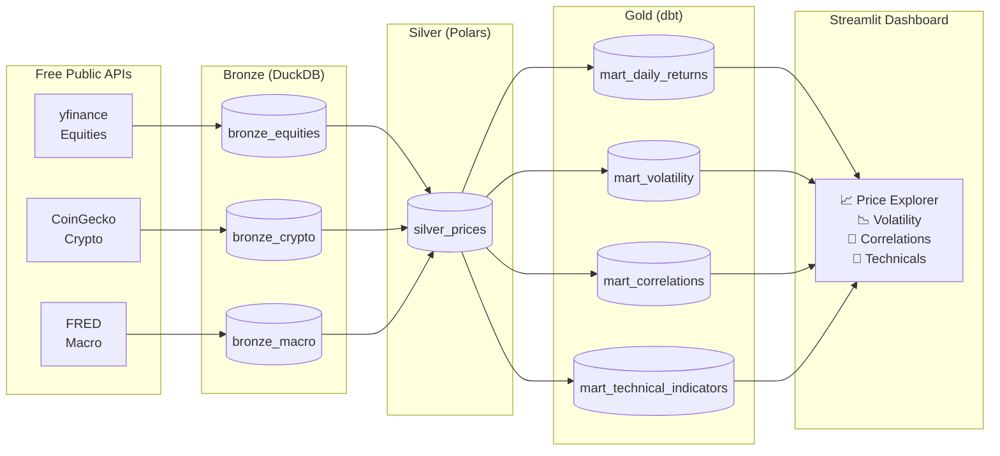

# MarketLens

[](https://github.com/your-username/marketlens/actions/workflows/ci.yml)
[](https://www.python.org/downloads/)
[](https://github.com/duckdb/dbt-duckdb)
[](https://pola.rs/)
[](LICENSE)

> End-to-end financial market data pipeline — **DuckDB · dbt · Polars · Prefect · Streamlit**.
> Medallion architecture (Bronze → Silver → Gold) with automated CI and Docker deployment.

---

## What it does

MarketLens ingests equity, crypto, and macroeconomic data from free public APIs, transforms
it through a three-layer medallion architecture, and surfaces analytics in an interactive
Streamlit dashboard — all running locally with a single `docker compose up`.

**Highlights:**
- **Polars** window functions for fast, idiomatic Silver-layer transforms
- **dbt** Gold models: rolling vol, Pearson correlations, RSI-14, MACD, and Bollinger Bands — all in SQL
- **DuckDB** as the embedded OLAP warehouse — no server, no config, just a file
- **Prefect 3** `flow.serve()` for weekday scheduling without Cloud or a work pool
- **Idempotent ingest** via `INSERT OR REPLACE` on `PRIMARY KEY (symbol, date)`
- **Zero API keys** — Yahoo Finance, CoinGecko public endpoint, FRED

---

## Architecture



For a detailed walkthrough, see [docs/architecture.md](docs/architecture.md).

---

## Tech Stack

| Layer | Tool | Why |
|---|---|---|
| Data processing | [Polars](https://pola.rs/) | Faster than pandas; `.over()` window idiom is cleaner than groupby |
| Data warehouse | [DuckDB](https://duckdb.org/) | Embedded OLAP — no server, zero infra, fast analytical queries |
| SQL transforms | [dbt-duckdb](https://github.com/duckdb/dbt-duckdb) | Most in-demand data engineering tool; lineage graph, tests, docs |
| Orchestration | [Prefect 3](https://www.prefect.io/) | `flow.serve()` — modern OSS scheduling without Cloud/agents |
| Dashboard | [Streamlit](https://streamlit.io/) + [Plotly](https://plotly.com/) | Fast interactive analytics UI |
| Config | [pydantic-settings](https://docs.pydantic.dev/latest/concepts/pydantic_settings/) | Typed `.env` loading |
| Linting | [ruff](https://github.com/astral-sh/ruff) | Replaces flake8 + isort + pyupgrade |
| CI | GitHub Actions | Lint → type-check → test → dbt compile |
| Infra | Docker Compose | Reproducible local deployment |

---

## Quick Start

### Option A — Docker (zero setup)

```bash
git clone https://github.com/your-username/marketlens.git
cd marketlens
cp .env.example .env

# Load 2 years of synthetic sample data (no live API calls)
docker compose run --rm seed

# Start the pipeline scheduler + dashboard
docker compose up dashboard
# Open http://localhost:8501
```

### Option B — Local Python

**Prerequisites:** Python 3.12+, `pip`

```bash
git clone https://github.com/your-username/marketlens.git
cd marketlens
make install       # pip install -e ".[dev]"
cp .env.example .env
```

**With live data (requires internet):**
```bash
make bootstrap     # create DuckDB schema
make pipeline      # ingest → transform → dbt run + test
make dashboard     # open http://localhost:8501
```

**With synthetic demo data (no internet needed):**
```bash
make bootstrap
python scripts/seed_sample_data.py   # generates 2 years of GBM prices
make dbt-run
make dashboard
```

### Scheduled pipeline (Prefect)

```bash
# Start the weekday 06:00 UTC scheduler (keeps running)
make flows

# Or trigger a one-shot run
python -c "from marketlens.flows.pipeline_flow import pipeline; pipeline()"

# View the local Prefect UI (optional, separate terminal)
prefect server start   # http://localhost:4200
```

---

## Dashboard Pages

| Page | Description |
|---|---|
| **Price Explorer** | Multi-symbol normalised cumulative returns, OHLCV candlestick, return distributions |
| **Volatility** | Rolling 30d/90d realised vol, Garman-Klass estimator, monthly regime heatmap |
| **Correlations** | Rolling Pearson correlation matrix, Ward-linkage dendrogram, pair time series |
| **Technicals** | RSI-14, MACD, Bollinger Bands — all computed in dbt SQL window functions |

---

## Project Structure

```
marketlens/
├── marketlens/               # Installable Python package
│   ├── config.py             # Typed settings (pydantic-settings)
│   ├── db.py                 # DuckDB connection factory + schema bootstrap
│   ├── ingestion/            # Bronze ingesters: equities, crypto, macro
│   ├── transforms/           # Silver: normalize, clean, enrich (Polars)
│   └── flows/                # Prefect pipeline flow
├── dbt/
│   ├── models/
│   │   ├── silver/           # Staging views (stg_equities, stg_crypto, stg_macro)
│   │   └── gold/             # mart_* analytics tables
│   └── tests/                # Custom singular dbt tests
├── dashboard/
│   ├── app.py                # Entry point
│   ├── components/           # data_access.py, charts.py
│   └── pages/                # 01_price_explorer, 02_volatility, 03_correlations, 04_technicals
├── tests/                    # pytest (unit + network-marked integration tests)
├── scripts/                  # bootstrap_db, run_ingest, run_transforms, seed_sample_data
├── docs/                     # architecture.md, data-dictionary.md
├── Dockerfile                # Multi-stage build
└── docker-compose.yml        # pipeline + dashboard + seed services
```

---

## Data Sources

All **free, no API keys required**:

| Source | Assets | Library |
|---|---|---|
| [Yahoo Finance](https://finance.yahoo.com/) | SPY, QQQ, GLD, TLT, IWM | `yfinance` |
| [CoinGecko](https://www.coingecko.com/) | BTC, ETH, SOL | `requests` (public endpoint) |
| [FRED](https://fred.stlouisfed.org/) | 10Y Treasury yield, Fed Funds rate, unemployment rate | `pandas-datareader` |

Configurable via `.env` — see `.env.example`.

---

## Analytics in SQL

The Gold layer implements financial analytics entirely in DuckDB window functions:

```sql
-- RSI-14 (mart_technical_indicators.sql)
CASE
    WHEN avg_loss_14 = 0 THEN 100.0
    ELSE 100.0 - (100.0 / (1.0 + avg_gain_14 / avg_loss_14))
END AS rsi_14

-- 90-day rolling Pearson correlation (mart_correlations.sql)
CORR(return_a, return_b)
    OVER (PARTITION BY symbol_a, symbol_b
          ORDER BY date
          ROWS BETWEEN 89 PRECEDING AND CURRENT ROW) AS rolling_corr_90d

-- Annualised realised volatility (mart_volatility.sql)
STDDEV(log_return)
    OVER (ORDER BY date ROWS BETWEEN 29 PRECEDING AND CURRENT ROW)
    * SQRT(252) AS rolling_vol_30d
```

See [docs/data-dictionary.md](docs/data-dictionary.md) for full schema documentation.

---

## Development

```bash
make lint       # ruff check + format check
make format     # ruff fix + format
make test       # pytest (no network)
make test-all   # pytest including live API tests
make dbt-docs   # open dbt lineage graph in browser
```

---

## License

MIT
