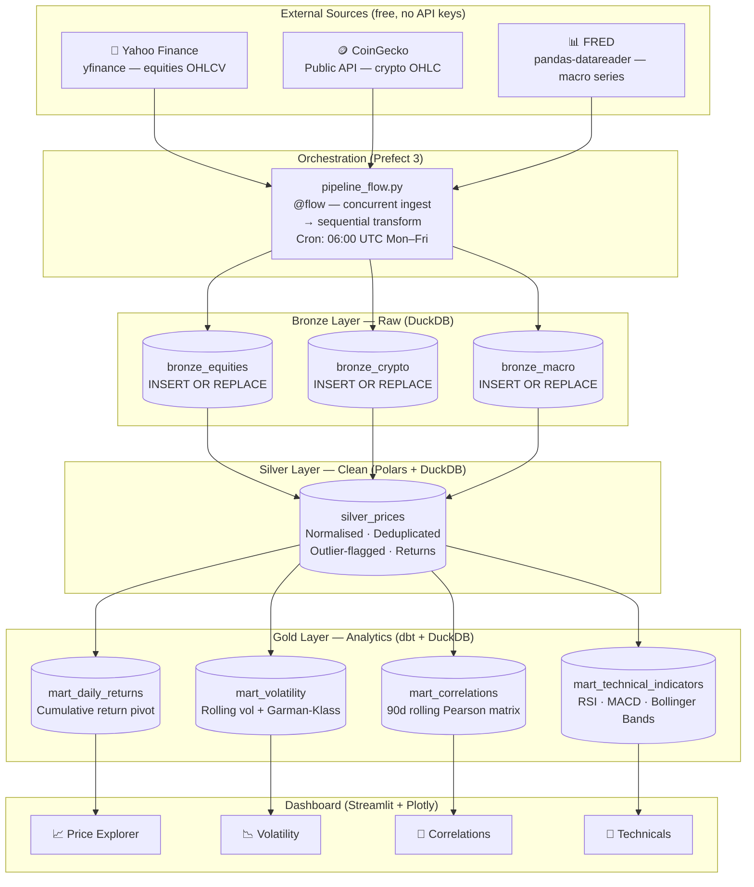
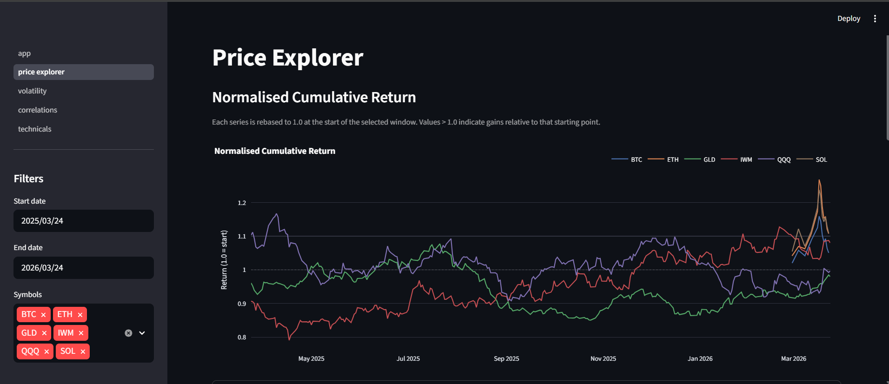
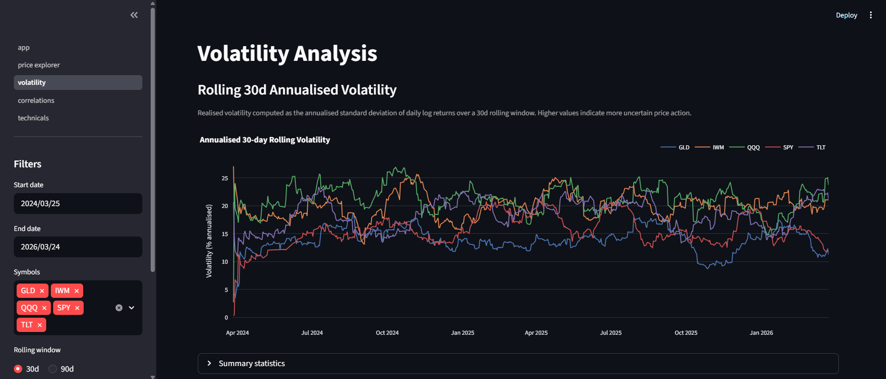
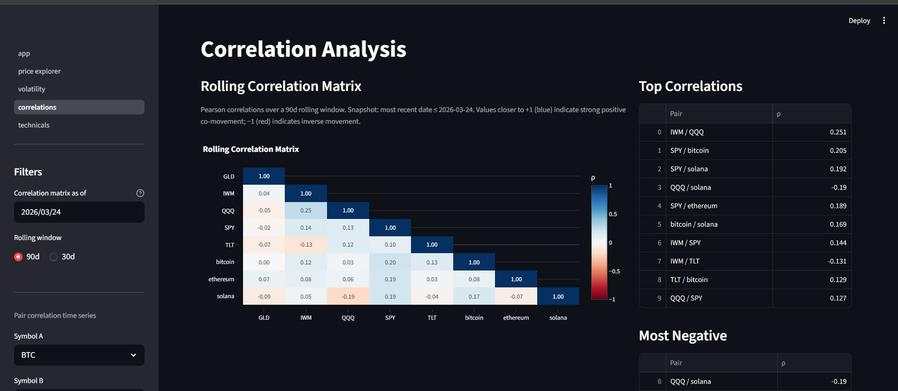

# Architecture

MarketLens is organised as a **medallion architecture** — a three-layer pattern common
in modern data engineering where each layer has a clear contract:

| Layer | Storage | Technology | Purpose |
|---|---|---|---|
| **Bronze** | DuckDB | Python ingestion classes | Raw, immutable source data |
| **Silver** | DuckDB | Polars transformations | Cleaned, enriched, normalised |
| **Gold** | DuckDB | dbt SQL models | Business-ready analytics mart |

---

## Full Pipeline Diagram



---

## Layer Details

### Bronze — Raw Ingestion

**Goal:** Store exactly what was fetched, with no transformations. Idempotent.

Each source has a dedicated ingester class extending `BaseIngester`:

| Class | Source | Target table | Key pattern |
|---|---|---|---|
| `EquitiesIngester` | Yahoo Finance via `yfinance` | `bronze_equities` | `INSERT OR REPLACE` on `(symbol, date)` PK |
| `CryptoIngester` | CoinGecko public OHLC endpoint | `bronze_crypto` | Same; rate-limit backoff |
| `MacroIngester` | FRED via `pandas-datareader` | `bronze_macro` | Same; `close` column holds the series value |

All three Bronze tables share the same schema:
```
source, symbol, date (PK), open, high, low, close, volume, ingested_at
```

---

### Silver — Cleaning and Enrichment

**Goal:** A single unified table (`silver_prices`) that all dbt models read from.

Implemented in Polars (`marketlens/transforms/`):

1. **Normalize** — unify schemas across sources; add `asset_class` column
2. **Deduplicate** — keep the latest row per `(symbol, date)`
3. **Handle nulls** — forward-fill up to 3 consecutive missing close prices per symbol
4. **Flag outliers** — MAD-based robust z-score; `is_outlier = TRUE` rows are excluded by dbt staging views
5. **Compute returns** — `pct_change().over("symbol")` for daily return; `log1p` for log return
6. **Rolling stats** — 30-day and 90-day rolling mean and std (used as Silver-layer features)

Key Polars pattern:
```python
df.sort("date").with_columns(
    pl.col("close").pct_change().over("symbol").alias("daily_return")
)
```
The `.over("symbol")` performs a per-group window without a `groupby` — the correct Polars idiom.

---

### Gold — Analytics Mart (dbt)

**Goal:** Business-ready tables consumed directly by the dashboard.

| Model | Description | Notable SQL |
|---|---|---|
| `mart_daily_returns` | Long-format daily returns + cumulative return | `EXP(SUM(log_return) OVER ...)` |
| `mart_volatility` | Rolling 30d/90d annualised vol + Garman-Klass estimator | `STDDEV() OVER ... * SQRT(252)` |
| `mart_correlations` | 90d rolling Pearson correlation per asset pair | `CORR() OVER (ROWS BETWEEN 89 PRECEDING AND CURRENT ROW)` |
| `mart_technical_indicators` | RSI-14, MACD, Bollinger Bands with %B | RSI via `AVG(gain)/AVG(loss)` window functions |

dbt tests run after every model run:
- Generic: `not_null`, `unique`, `accepted_values` on key columns
- Singular: `assert_price_positive`, `assert_no_future_dates`, `assert_rsi_bounds`, `assert_correlation_bounds`

---

## Orchestration

Prefect 3 `flow.serve()` starts a long-running process that schedules the pipeline
without requiring Prefect Cloud, an agent, or a work pool:

```python
pipeline.serve(
    name="marketlens-weekday-scheduler",
    cron="0 6 * * 1-5",       # 06:00 UTC, Mon–Fri
    parameters={"lookback_days": 3},
)
```

The three ingest tasks run **concurrently** via `.submit()`. The Silver transform
and dbt steps run **sequentially** after all ingest futures resolve.

---

## Data Flow: DuckDB Schema

```
main (schema)
├── bronze_equities
├── bronze_crypto
├── bronze_macro
└── silver_prices

main_main (schema — dbt materialises here with +schema: main)
├── mart_daily_returns
├── mart_volatility
├── mart_correlations
└── mart_technical_indicators
```

The `main_main` double-prefix occurs because dbt-duckdb appends the `+schema: main`
config value to the default DuckDB schema name (`main`), producing `main_main`.
The dashboard queries use `main_main` explicitly.


---

## Dashboard Screenshots

### Price Explorer
Normalised cumulative returns across all assets, OHLCV candlestick, and return distributions.



### Volatility Analysis
Rolling realised volatility, Garman-Klass estimator comparison, and monthly vol regime heatmap.



### Correlation Analysis
Rolling Pearson correlation matrix with hierarchical clustering dendrogram.


